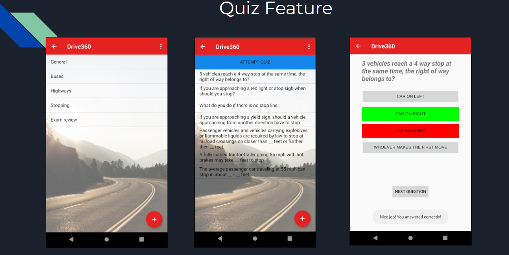

# Drive 360 - [Video Demo](https://www.youtube.com/watch?v=rf12ErUmwHU&t=277s)  

[Drive 360 Presentation](https://docs.google.com/presentation/d/1xL7NRLZldvfqtNInGwTzJ_mAhTbXMXgQtFnKLLsP35w/edit#slide=id.p) 
[Drive 360 Write-up](https://docs.google.com/document/d/1qdIr72hjBhfkDsIyKGC3UVYc2gN9TthB4sy9NOU5dy4/edit)

We are hoping to push this app to the Play Store! 
For most updated version of Android features, please see [Drive360_Android](https://github.com/khoa165/Drive360_Android).

## Team Members
Kenneth Mui, [klmui@wisc.edu](mailto:klmui@wisc.edu), GitHub: klmui
Monica Schmidt, [meschmidt@wisc.edu](mailto:meschmidt@wisc.edu), GitHub: monica22schmidt
Benjamin Carpenter, [blcarpenter@wisc.edu](mailto:blcarpenter@wisc.edu), GitHub: blcarpenter
Khoa Thien Le (Harry), [ktle4@wisc.edu](mailto:ktle4@wisc.edu), GitHub: khoa165

## Summary

Drive 360 helps students in driver’s education classes learn the rules of driving by immersing them into interactive VR environments. It also provides a mobile-platform for users to post tips, take practice exams, share practice sets, and learn.

## Abstract/Introduce App

1.  “16-year olds have higher crash rates than drivers of any age”. With new advances in VR technology, people have sought to use it for educational purposes. In this case, we will use it to help people drive by providing an immersive VR experience.
    
2.  Users will be asked questions while the video is going on. The 360 video will pause when the app wants the user to complete a task. For example, to continue the 360 video, users will be required to look left, right, and left while they are at a stop sign, shoulder check while merging onto a highway or changing lanes, and look at mirrors when performing actions. Users will also be able to take a 360 tour of the inside of a car to get familiar with it.
    
3.  It is understandable that some people might be scared to get started with learning how to drive. The transition from reading manuals and rule books to actually driving the car might be uneasy for beginners. Aiming to alleviate the fear some might have, the app targets teenagers at the age of learning how to drive as well as people having anxious feelings while driving.

## Mobile innovation

The app is very mobile-driven innovative since it focuses on turning tedious driving tutorials into a more interactive and dynamic platform that excites the users and encourages their engagement with the app.  This app can be used in driver’s education classes and as a learning resource for people learning how to drive since the equipment is not too expensive for classrooms.
    
## Implementation

## Screenshots

## Wireframes

## VR Wireframes Description

1.  A description of the 'flow' of your app. This should describe how users will navigate between the VR Videos and the interactive experiences:

    When users load the Android app, they will be presented with a big button that says “Drive”. Once they click that button, they will be loaded into a “VR lobby”. If they want to go back into the Android application, they can just click the back button on their Android device. The VR lobby includes cubes with labels for each driving scenario. If the user looks at a certain cube for a couple of seconds, that scenario will play.

2.  A description of each of the different locations/activities that you will make VR videos in/about:

    One of our team members, Monica, has a car. So we probably meet together and take VR videos while driving on the highway and in residential areas. We plan to have a camera with 360 capability facing the driving direction and simulate different driving scenarios. We also plan on taking a 360 picture in Monica’s car so users can interact with it and see where things are located.

3.  A description of each of the VR experiences you are going to create:
    We plan to simulate the following scenarios:
-   Driving on highway
-   Driving with snow weather
-   Driving in rain weather
-   Encountering traffic signs and road signs

4.  A description of the heads-up display elements:

    We will set up the camera to face the road to simulate driving experience. The user using VR app will look mostly to the front, which focuses on the road. However, since we are going to use a camera with 360 capability, the user has options to look around, checking the left and right side and turning around to look at the back. The app will require the user to do shoulder checks and make sure that they are clear to pass each intersection.

## Milestone 1 (Due March 15th)

-   Record 360 videos for merging onto the highway and lane changing.
-   Take a 360 picture inside of the car.
-   Unity:
    -  Learn from Unity resources on how to add interactivity in Unity with C# scripts.
    
    -   Import the 360 videos and make the VR lobby.
    
    -   Load the specific 360 video when users look at its associated cube in the VR lobby.
    

-   Android:
    

    -   Set up the dummy project to link between the VR section on Unity and landing screen on Android Studio.
    
    -   Set up the home page like the wireframe above.
    

## Milestone 2 (Due March 29th)

-   Unity:
    

    -   Add more VR videos that simulate different scenarios in driving.
    
    -   Pause the videos at certain times to present the user with questions.
    
    -   Indicate whether the user was right or wrong after answering the question.
    
    -   Optional: show the user a list of questions they got right or wrong.
    

-   Android:
    

    -   Set up activities for login, register, learn, feedback, and test (layouts).
    
    -   Setup menu for login and register.
    
    -   Link activities.
    
    -   Add driving manuals to the learn section.
    

## Milestone 3 (Due April 12th)

-   Unity:
    

    -   Continue to work on VR user experiences.
    
    -   Work on creating the 360 environment for the car so users can interact with it see where things are located inside of the car.
    

-   Android:
    

    -   Set up authentication and a database to store the user’s progress in previous test attempts.
    
    -   Create tests for the “Tests” portion of the app and present their score at the end.
    

## Milestone 4 (Due April 26th)

-   Unity:
    

    -   Finalize the VR videos and link it to the Android app.
    
    -   Fix any bugs.
    
    -   Optional: Track the user’s progress within the Unity application.
    

-   Android:
    

    -   Improve user interface and user experiences.
    
    -   Fix any bugs that might crash the app.
    
    -   Do comprehensive app testing.
    
    -   Prepare for demo.
    
    -   Optional: allow users to share their scores on social media.

## Resources

These are some of the resources I used when embedding a VR Unity app inside an Android application that has large assets. There were many issues so I hope this helps :) :

- [Embedded Unity within Android App](https://medium.com/@davidbeloosesky/embedded-unity-within-android-app-7061f4f473a)

- [Integration Unity as a library in native Android app Version 2](https://forum.unity.com/threads/integration-unity-as-a-library-in-native-android-app-version-2.751712/)

- The first two links have a section for comments which helped me solve some errors.

- [Git LFS Tutorial (Migration + using Git LFS for already tracked asset)](https://github.com/git-lfs/git-lfs/wiki/Tutorial)

- [Git Large File Storage - How to Work with Big Files](https://www.youtube.com/watch?v=uLR1RNqJ1Mw)

- [INSTALL_FAILED_NO_MATCHING_ABIS when install apk](https://stackoverflow.com/questions/24572052/install-failed-no-matching-abis-when-install-apk)

- [How to solve “libmain.so not found” while using Unity as a library in Android application with latest AndroidX Versions out of ReactNative](https://stackoverflow.com/questions/58877735/how-to-solve-libmain-so-not-found-while-using-unity-as-a-library-in-android-ap)

- [Crashes on Android due to error "libmain.so not found"](https://github.com/f111fei/react-native-unity-view/issues/142#issuecomment-557162700)

- [Why is the Unity Video Player not working? (Video not playing in Android)](https://github.com/f111fei/react-native-unity-view/issues/77)

- [Fix Unity merge conflicts with these commands](https://stackoverflow.com/questions/38536896/git-reset-hard-origin-master-failing)
